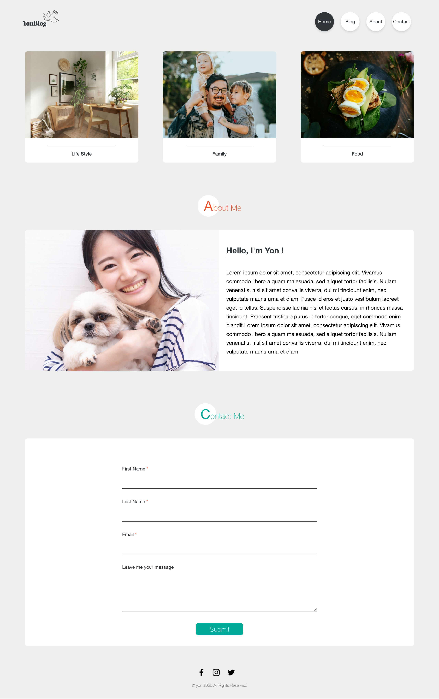

# YonBlog (Astro Learning Project)

<div align="center">
  
</div>

## Overview

YonBlog is a simple blog-style web page built as part of my learning process with Astro.  

---

## Project Structure

Inside of your Astro project, you'll see the following folders and files:

```text
/
├── public/
│   ├── assets/               # Static images, icons, and other assets
│   └── favicon.svg
├── src/
│   ├── components/
│   │   └── React/            # React components used in Astro pages
│   ├── layouts/              # Page layout components
│   ├── pages/                # Astro page files (index, about, etc.)
│   ├── styles/               # Global CSS (Tailwind base + custom)
│   ├── About.astro
│   ├── Footer.astro
│   └── Header.astro
├── astro.config.mjs
├── package.json
├── tailwind.config.js
├── tsconfig.json
└── README.md
```

## Commands

All commands are run from the root of the project in your terminal:

| Command                   | Action                                           |
| :------------------------ | :----------------------------------------------- |
| `npm install`             | Installs dependencies                            |
| `npm run dev`             | Starts local dev server at `localhost:4321`      |
| `npm run build`           | Build your production site to `./dist/`          |
| `npm run preview`         | Preview your build locally, before deploying     |
| `npm run astro ...`       | Run CLI commands like `astro add`, `astro check` |
| `npm run astro -- --help` | Get help using the Astro CLI                     |

## learn more

This project was built with Astro, React, and Tailwind CSS as a learning project to understand Astro’s component structure and static site generation.

For documentation and community resources:
- [Astro Documentation](https://docs.astro.build)
- [Astro Discord Community](https://astro.build/chat)
